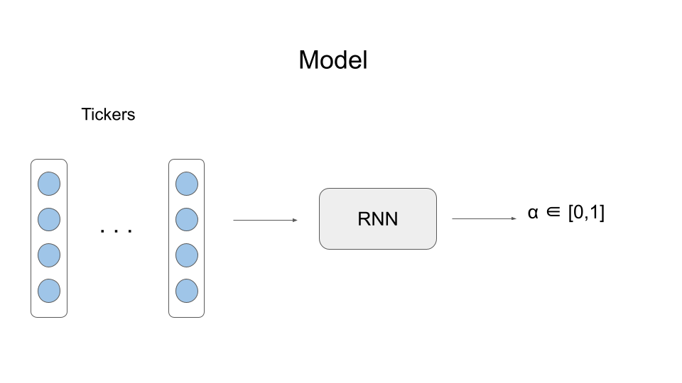

# TradeBot

## Usage

1. Запустить postgres и model service, cм. `database-docker` и `model-serving-docker`
2. Настроить конфиги, пример в `configs-example`
3. Запустить с флагами:
> -- kraken_config_path \
> -- model_config_path \
> -- bot_config_path \
> -- telegram_creds_path \
> -- dsn_path

Настройки бота включают в себя:

- `instrument`
- `order_size` - размер заявки
- `max_position_size` - максимальный размер позиции (int)
- `decision_threshold` - порог принятия решения (float)
- `sequence_length` - длина обрабатываемой последовательности (int)
- `price_slip_percent` - отклонение цены от Bid/Ask в % для увеличения вероятности исполнения заявки (int)

## Repository

Сохраняет сделки со следующей информацией:
> **symbol, side, order_type, order_price, order_size, actual_price, actual_amount, timestamp**

## Notifications

- Уведомления присылаются всем подписавшимся пользователям
- Формируются с помощью template
- Job Queue c настраиваемым размером буффера

Примеры уведомлений:

> The order has been **EXECUTED**: \
> buy 3 pi_xbtusd at 57311

> Sending the order **FAILED.** \
> Status: insufficientAvailableFunds

## Endpoints

> POST: /start

> POST: /stop

## Trading Strategy

###Pipeline

1. Подписывается на тикеры и собирает последовательности длины `sequence_length` (отдельная go-routine)
2. Каждый тикер преобразуется в вектор, в который входят все численные поля структуры
3. Последовательность векторов отсылается по http сервису с RNN (TF Serving) и получает предсказание,
вещественное число x в пределах от 0 до 1
4. Действия:
   - x > `decision_threshold` : BUY
   - x < 1 - `decision_threshold` : SELL
   - else: DO NOTHING
5. Формируется **IOC** ордер размером `order_size`. 
Но в случае если размер позиции по абсолютной величине после выполнения превысит `max_position_size`, то размер заявки обрезается чтобы оставаться в пределах
(страховочный лимит)

Преимущества RNN:
- Работает с последовательностями переменной длины
- Сохраняет информацию в скрытом состоянии с момента запуска
